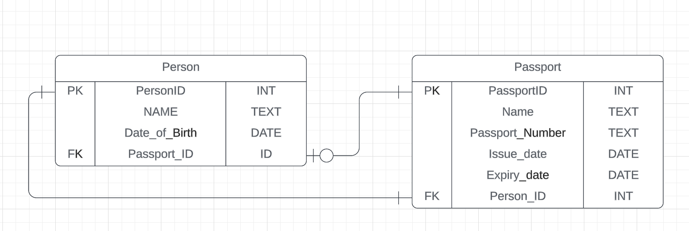

# One to One Relationships

## Exercise 1: Apartment Complex

Entities:

    Apartment: id (Primary Key), room_number, active (Boolean), renter_id (Foreign Key)
    Renter: id (Primary Key), first_name, last_name, email, license_number, apartment_id (Foreign Key)

Task: Create an ER diagram showing each apartment linked to one unique renter and vice versa.

##

## Exercise 2: Airport

Entities:

    Person: id (Primary Key), name, date_of_birth, passport_id (Foreign Key)
    Passport: id (Primary Key), passport_number, issue_date, expiry_date, person_id (Foreign Key)

Task: Illustrate how each person has a unique passport, with a one-to-one correspondence.

 
 
 
 

# One to Many Relationships
 
Create ER diagrams for the following exercises.
  

## Exercise 3: Library

Entities:

    Book: id (Primary Key), title, publication_year
    Author: id (Primary Key), name, nationality
    BookAuthor: book_id (Foreign Key), author_id (Foreign Key)

Task: Create an ER diagram to illustrate a scenario where each book can be written by multiple authors. The "BookAuthor" table acts as an intermediary to link books with their authors, reflecting a one-to-many relationship from authors to books.

