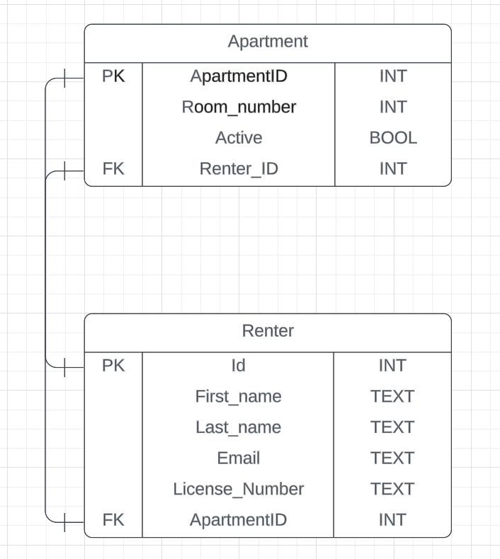
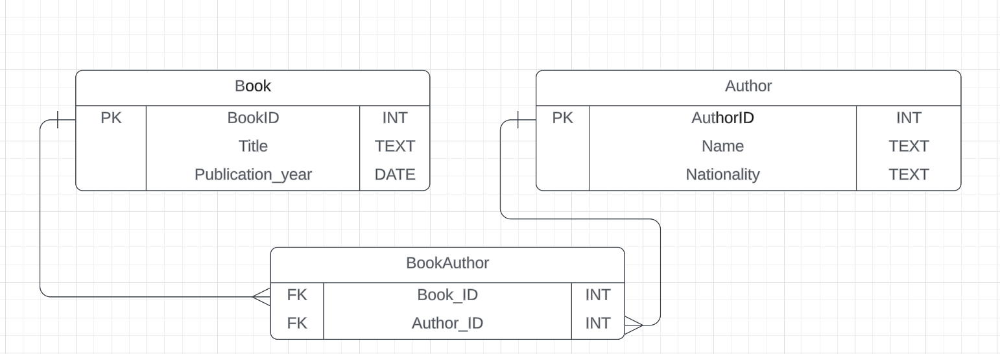

# EDR Diagrams

## One to One Relationships

Using the above tools, create ER diagrams for the following exercises.

### Exercise 1: Apartment Complex

Entities:

    Apartment: id (Primary Key), room_number, active (Boolean), renter_id (Foreign Key)
    Renter: id (Primary Key), first_name, last_name, email, license_number, apartment_id (Foreign Key)

Task: Create an ER diagram showing each apartment linked to one unique renter and vice versa.

##

### Exercise 2: Airport

Entities:

    Person: id (Primary Key), name, date_of_birth, passport_id (Foreign Key)
    Passport: id (Primary Key), passport_number, issue_date, expiry_date, person_id (Foreign Key)

Task: Illustrate how each person has a unique passport, with a one-to-one correspondence.

 
 
 
 

## One to Many Relationships
 
Create ER diagrams for the following exercises.
  

### Exercise 3: Library

Entities:

    Book: id (Primary Key), title, publication_year
    Author: id (Primary Key), name, nationality
    BookAuthor: book_id (Foreign Key), author_id (Foreign Key)

Task: Create an ER diagram to illustrate a scenario where each book can be written by multiple authors. The "BookAuthor" table acts as an intermediary to link books with their authors, reflecting a one-to-many relationship from authors to books.

### Exercise 4: Rent (Customers and Cars)

Entities:

    Customer: id (Primary Key), name, contact_info
    Car: id (Primary Key), make, model
    Rental: rental_id (Primary Key), customer_id (Foreign Key), car_id (Foreign Key), rental_date, return_date

Task: Develop an ER diagram showing how a customer can rent multiple cars over time. The "Rental" entity serves as an intermediary, linking customers with cars and capturing details of each rental transaction.

 
 
 

## Many to Many Relationships
 

## Exercise 5: Grade School

Entities:

    Student: id (Primary Key), name, grade_level
    Course: id (Primary Key), course_name, department

To establish a many-to-many relationship, we need to create a third table to link the two entities.

Task: Show how students can enroll in multiple courses, with courses having multiple students.

## Exercise 6: Work

Entities:

    Employee: id (Primary Key), name, department
    Project: id (Primary Key), project_name, deadline

To establish a many-to-many relationship, we need to create a third table to link the two entities.

Task: Create an ER diagram where employees work on multiple projects, and each project involves multiple employees.
Optional

Revisit the project you've worked on in the Front End Cohort and design an entity relationship diagram for the database you've created.

